# The Scandi Quiz

For the second Portfolio Project with Code Institute, I have created an online Quiz game about Scandinavia.
The questions are about the Scandinavian countries, both geographically and some fun facts question in different difficulties.

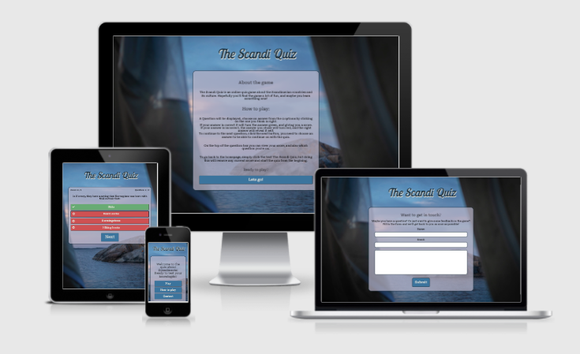

For the live game please click [here](https://ajn0r.github.io/scandi-quiz/index.html)

Table of content.
  * [Who is the website for?](#who-is-the-website-for)
  * [What does it do?](#what-does-it-do)
  * [User Experience](#user-experience)
    + [User Goals](#user-goals)
    + [User stories](#user-stories)
      - [From a first-time visitors perspective](#from-a-first-time-visitors-perspective)
      - [First-time visitor perspective Fulfilment](#first-time-visitor-perspective-fulfilment)
      - [From a returning visitors perspective](#from-a-returning-visitors-perspective)
      - [Returning visitor Fulfilment](#returning-visitor-fulfilment)
  * [Features](#features)
    + [Structure](#structure)
      - [First page / Home page](#first-page---home-page)
      - [Game page](#game-page)
      - [About page](#about-page)
      - [Contact page](#contact-page)
  * [Wireframes](#wireframes)
  * [Color & Fonts](#colors-and-fonts)
    + [Colors](#colors)
    + [Fonts](#fonts)
  * [Media](#media)
  * [Features I would like to implement in the future](#features-i-would-like-to-implement-in-the-future)
  * [Testing](#testing)
    + [Browser testing](#browser-testing)
      - [Issues](#issues)
    + [Lighthouse](#lighthouse)
    + [Validators](#validators)
    + [Local testing](#local-testing)
    + [Responsiveness](#responsiveness)
      - [Issues discovered](#issues-discovered)
  * [Deployment](#deployment)
  * [Technologies and resources used](#technologies-and-resources-used)
  * [Credits](#credits)

## Who is the website for?
  
The quiz is for anybody that wants to play an online quiz game for fun or to test their knowledge about Scandinavia.
The game is also for those wanting to learn some fun facts about Scandinavia, or someone who is just a little curious about the Scandinavian countries.

## What does it do?

The quiz displays a question and lets the player choose from 4 different answers. The user then can choose the answer they believe is right, the correct answer will change background color to green, and all the wrong answers will turn red. The user can see which answer they chose from the border around it. If the player is correct he or she will be given a point, adding it to the score tracker above the question. The player can also see which question they are on.

The player can not go forward with the quiz if they have not chosen an answer, only once they have done that will the next button appears and they can move on to the next question.

## User Experience

### User Goals

- The website must be responsive, so that the quiz can be played on a range of screen sizes, from mobile to extra-large screens.
- The game should be a fun quiz, but also for those who would like to test their knowledge with a range of different questions.
- The quiz must be easily navigated.
- The right and wrong answers should be clearly displayed for the player.
- The player must be able to keep track of their score.

### User stories

#### From a first-time visitors perspective

- As a first-time player, I want to easily find information on how to play the game.
- As a first-time player, I want to be able to see my score and know how I’m getting on.
- As a first-time player, I want to know which question I am on, and how many are left.
- As a first-time player, I would like to know which answers are correct and incorrect once I have given my answer. 

#### First-time visitor perspective Fulfilment

- [x] A first-time player can easily find information about how to play by choosing the menu option "how to play".
There the player is provided with instructions, then invited to play the game by clicking on the button "Let's go!"

- [x] The player can see their score at the top of the game area.

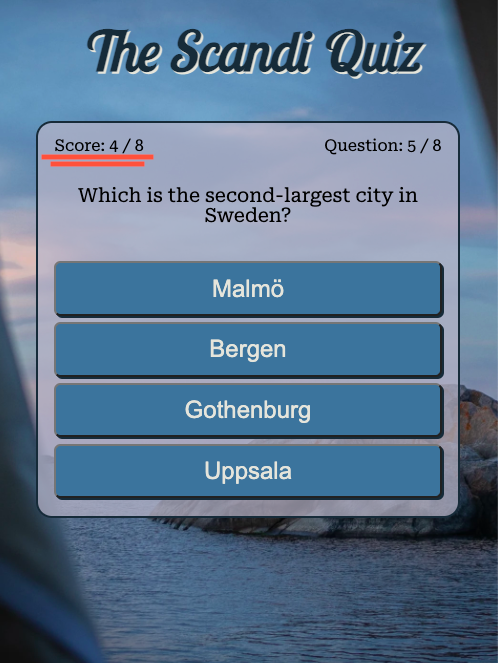

- [x] The player can see and follow along on which question they are on at the top right of the game area

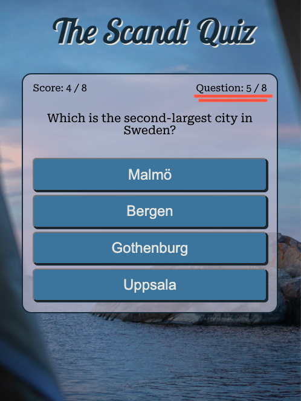

- [x] Once the player has chosen their answer, the correct and incorrect answers will reveal themself by changing color, also an icon will appear to the left.
The answer that the player chose will get a border, making it visually easy to see if it was correct or not.

If the answer is correct

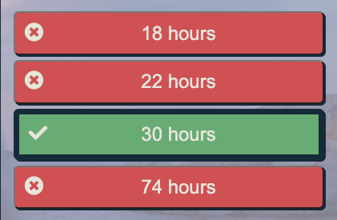

If the answer is incorrect

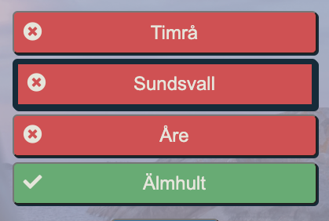

#### From a returning visitors perspective

- As a returning player, I would like a variety of questions, so that it is not the same every time I play.
- As a returning player, I want to send the maker of the quiz some feedback on the game.

#### Returning visitor Fulfilment

- [x] The game has a minimum of 24 questions which are shuffled every time so that the player should have at least some new questions if played several times.

- [x] The player can send their feedback, question, or whatever they might have on their heart to the owner of the quiz by filling in the contact form and pressing "submit"

## Features

The project includes several features:

- 2 HTML pages, 3 JavaScript files and one CSS file.
- 3 different menu options
- One contact form
- A scorekeeping function
- A function keeping track of which question the user is on.
- All buttons have a hover effect, making it visible clear to the player which button they are about to press.

### Structure

- The game consists of an of total 2 different html pages, with several sections on the index.html page.
- The index.html file holds the game and game area.
The game is split up into sections, the sections are then hidden or shown with the help of JavaScript, adding and removing classes.
- The contact page is on its own HTML file. 
The form on the page has no method attribute, so it won't lead the user anywhere in reality. Instead, have I used JavaScript to change the inner HTML of the page when the user clicks on 'submit'.
The player is then greeted with a 'Thank you' and the name they submitted in the name input and a note that the quiz master will get back to them in no time. 

The sections and pages are laid out logically, making them easily navigated for the user.

#### Menu section

- The home page consists of a background image of the Swedish Arcipelago and a menu with three alternatives.
  - Play
  - How to play
  - Contact

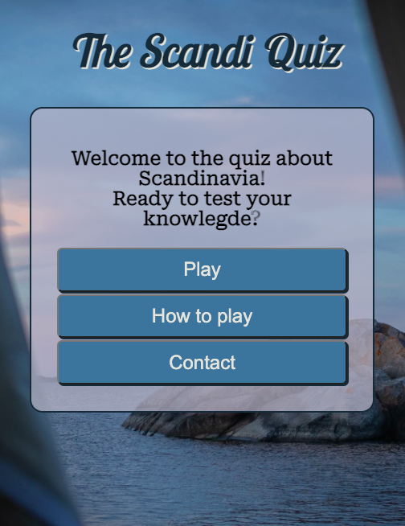

All buttons on the page change color if the player hover over them.

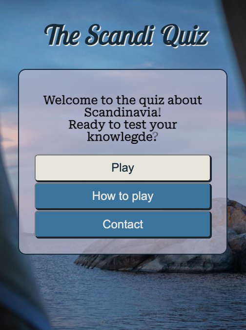

#### Game section

-  The Game page is where the user can play the quiz game

#### How to play section

- The how to play section lets the player know how the game is played, it's also where information about the game can be found if the player is curious.

- The section is reached by clicking on the "how to play" button on the first page.

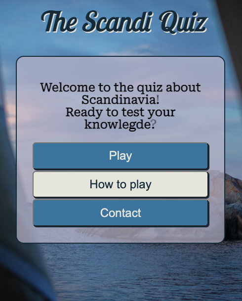

- The player can then scroll down on the information.
Once the player is finished reading, they can decide if they'd like to play straight away or go back to the main menu by clicking on the logo.

- A go back button has been added since this was done, so now the player can easily see how to get back to the menu.

#### Contact page

The contact page consists of a form where the user can get in touch with the owner of the quiz.

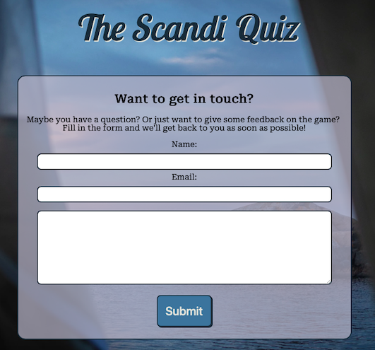

It is an HTML form without a method, instead, have I used JavaScript to change the inner HTML once the user presses the submit button. 

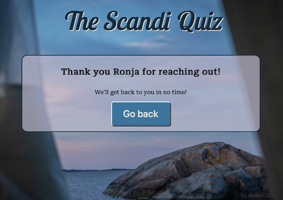

## Wireframes

Wireframes were made using Balsamiq Wireframes

- For phones

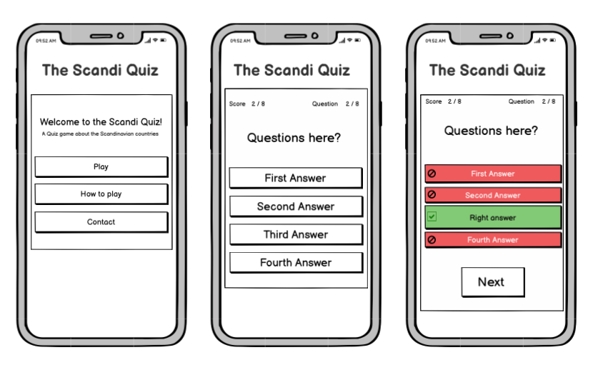

- Desktop 

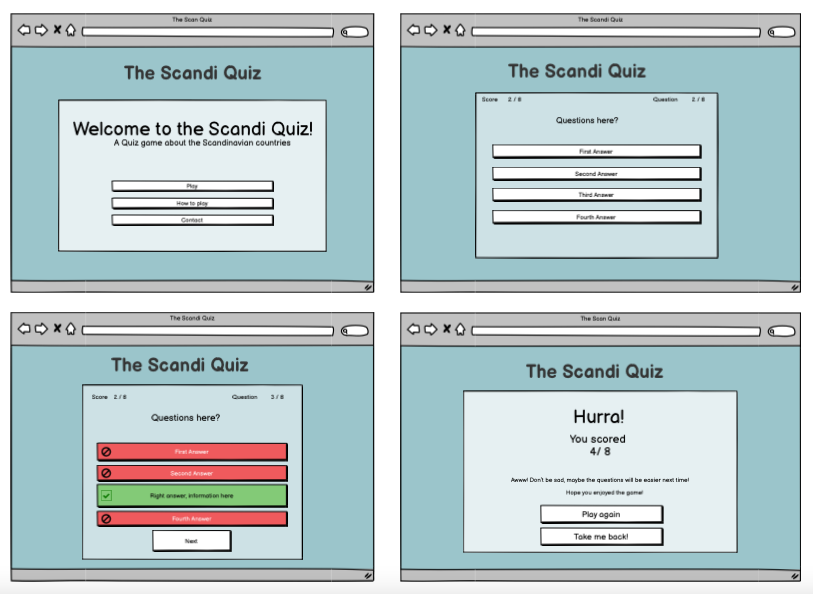

## Colors and Fonts

### Colors

I have found the colors for the game on Coolors.co.

The first three are the colors used for the overall style of the game. The green and red colors are for the answers, to display the correct and incorrect answers visibly. 

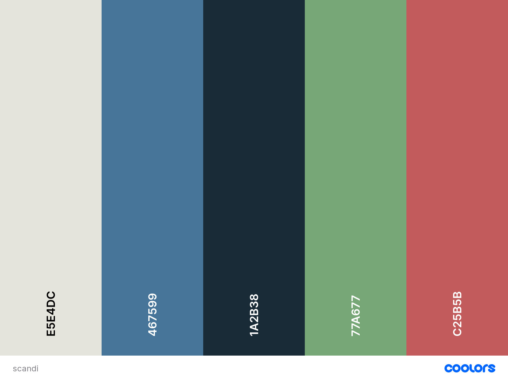

### Fonts

I have found my fonts on Google Font, the ones that I finally decided to use are:
-	«Lobster Two» for the header text
-	«Roboto Sans» for all other text.

## Media

## Features I would like to implement in the future
-	A high score feature.
-	More questions
-	Displaying images as part of a question

## Testing

### Browser testing

Browsers that the website has been tested on:

- Google Chrome
- Windows Edge
- Safari
- Firefox

#### Issues

### Lighthouse

Lighthouse on index.html page

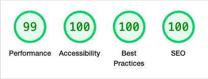

Lighthouse on contact page

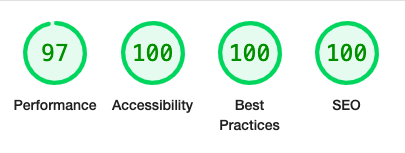

### Validators

The W3C Markup Validator and W3C CSS validator Services have been used to validate each page of the website to ensure no errors in the code.

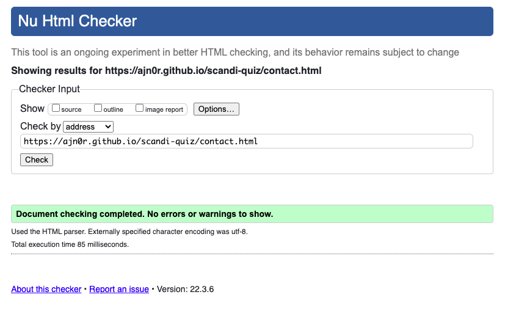

The Markup Validator did however find one error in the index.html, it was a stray div closing tag.

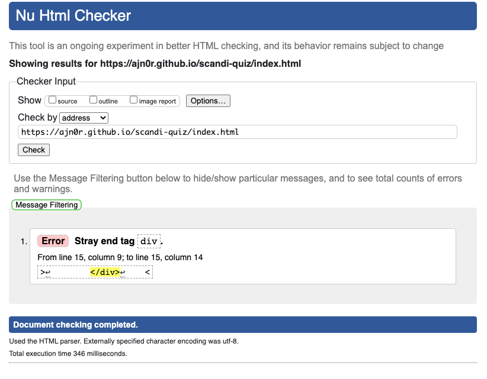

I removed it and the code then passed without any more errors.

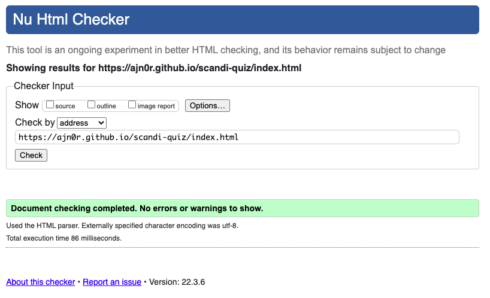

The CSS passed without any errors on the first attempt.

![]

### Local testing

### Responsiveness

#### Issues discovered

## Deployment

The website was deployed using GitHub pages

While in the repository, I clicked on settings.
Then onto pages in the sidebar

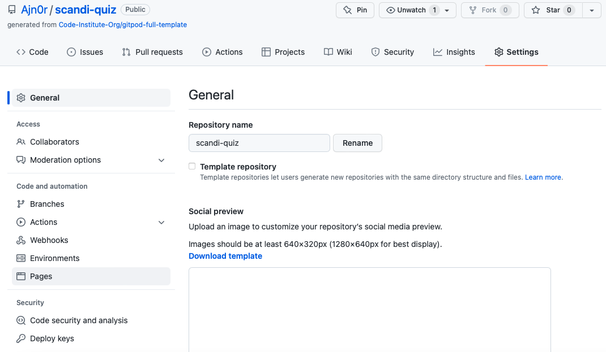

From here I selected the main branch under the Source section and clicked save.

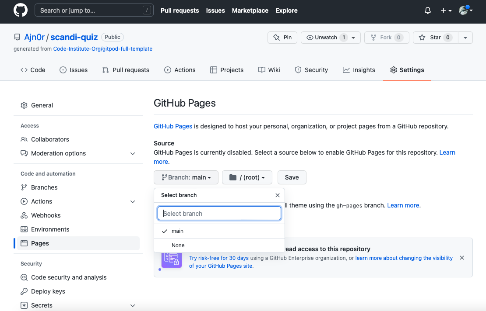

The game was deployed!

## Technologies and resources used

I have used:

- HTML5 for markup
- CSS3 for style
- Google Fonts for fonts
- Birme for image resizing and changing the format of background image
- Coolors.co for colors
- Font Awesome for icons
- Favicon.io for the favicon
- Git for version control
- GitHub for keeping the files, documents, and deployment of the site
- W3 School
- [GitHub Wiki TOC generator](https://ecotrust-canada.github.io/markdown-toc/) 
- [EZGIF.com for converting video to gif](https://ezgif.com/)
- Grammarly for grammar check
- Code Institute course material
- Code Institute Slack channel

## Credits
- I have used 
Web Dev Simplified YouTube video «Build A Quiz App with JavaScript» for the basic setup for the quiz.
Link to video here
