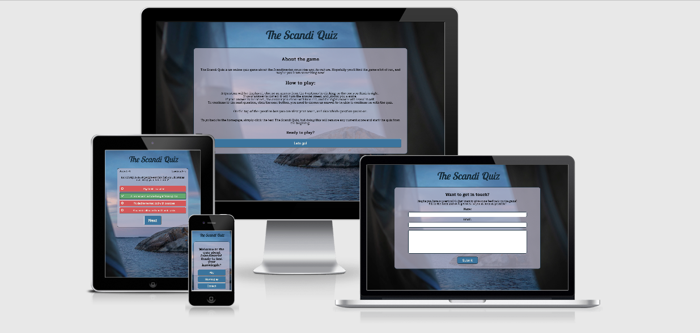

# The Scandi Quiz

For the second Portfolio Project with Code Institute, I have created an online Quiz game about Scandinavia.
The questions are about the Scandinavian countries, both geographically and some fun facts question in different difficulties.

For the live game please click [here](https://ajn0r.github.io/scandi-quiz/index.html)

Table of content.
  * [Who is the website for?](#who-is-the-website-for)
  * [What does it do?](#what-does-it-do)
  * [User Experience](#user-experience)
    + [User Goals](#user-goals)
    + [User stories](#user-stories)
      - [From a first-time visitors perspective](#from-a-first-time-visitors-perspective)
      - [First-time visitor perspective Fulfilment](#first-time-visitor-perspective-fulfilment)
      - [From a returning visitors perspective](#from-a-returning-visitors-perspective)
      - [Returning visitor Fulfilment](#returning-visitor-fulfilment)
  * [Features](#features)
    + [Structure](#structure)
      - [First page / Home page](#first-page---home-page)
      - [Game page](#game-page)
      - [About page](#about-page)
      - [Contact page](#contact-page)
  * [Wireframes](#wireframes)
    + [Color & Fonts](#color---fonts)
    + [Colors](#colors)
    + [Fonts](#fonts)
  * [Media](#media)
  * [Features I would like to implement in the future](#features-i-would-like-to-implement-in-the-future)
  * [Testing](#testing)
    + [Browser testing](#browser-testing)
      - [Issues](#issues)
    + [Lighthouse](#lighthouse)
    + [Validators](#validators)
    + [Local testing](#local-testing)
    + [Responsiveness](#responsiveness)
      - [Issues discovered](#issues-discovered)
  * [Deployment](#deployment)
  * [Technologies and resources used](#technologies-and-resources-used)
  * [Credits](#credits)

## Who is the website for?
	
The quiz is for anybody that wants to play an online quiz game for fun or to test their knowledge about Scandinavia.
The game is also for those wanting to learn some fun facts about Scandinavia, or someone who is just a little curious about the Scandinavian countries.

## What does it do?

The quiz displays a question and lets the player choose from 4 different answers. The user then can choose the answer they believe is right, the correct answer will change background color to green, and all the wrong answers will turn red. The user can see which answer they chose from the border around it. If the player is correct he or she will be given a point, adding it to the score tracker above the question. The player can also see which question they are on.

The player can not go forward with the quiz if they have not chosen an answer, only once they have done that will the next button appears and they can move on to the next question.

## User Experience

### User Goals

- The website must be responsive, so that the quiz can be played on a range of screen sizes, from mobile to extra-large screens.
- The game should be a fun quiz, but also for those who would like to test their knowledge with a range of different questions.
- The quiz must be easily navigated.
- The right and wrong answers should be clearly displayed for the player.
- The player must be able to keep track of their score.

### User stories

#### From a first-time visitors perspective

- As a user, I want to easily find information on how to play the game
- As a user, I want to be able to see my score and know how I’m getting on
- As a user, I want to know which question I am on, and how many are left.
- As a first time user 

#### First-time visitor perspective Fulfilment

#### From a returning visitors perspective

#### Returning visitor Fulfilment

## Features

The project includes several features:

- $ pages in total
- $ different menu options
- One contact form
- A scorekeeping function
- A function keeping track of which question the user is on.

### Structure

- The website consists of an of total $ different pages
The pages are laid out logically, making them easily navigated for the user.

#### First page / Home page

- The home page consists of a background image and a menu with three alternatives.
- Play
- How to play
- Contact

#### Game page

-  The Game page is where the user can play the quiz game

#### About page

- The about page lets the user know some information about the game, how to play it etc.... 

#### Contact page

The contact page consists of a form where the user can get in touch with the owner of the quiz.

It is an HTML form without a method, instead, have I used JavaScript to change the inner HTML once the user presses the submit button. 

## Wireframes

Wireframes were made for each of the pages, both for desktop and mobile.

### Color & Fonts

### Colors

I have found the colors for the website on Coolors.co

### Fonts

I have found my fonts on Google Font, the ones that I finally decided to use are:
-	«Lobster Two» for the header text
-	«Roboto Sans» for all other text.

## Media

## Features I would like to implement in the future
-	A high score feature.
-	More questions
-	Displaying images as part of a question

## Testing

### Browser testing

Browsers that the website has been tested on:

- Google Chrome
- Windows Edge
- Safari
- Firefox

#### Issues

### Lighthouse

### Validators

The W3C Markup Validator and W3C CSS validator Services have been used to validate each page of the website to ensure no errors in the code.

The Markup Validator did however find one error in the index.html, it was a stray div closing tag.

I removed it and the code then passed without any more errors.

The CSS passed without any errors on the first attempt.

![]

### Local testing

### Responsiveness

#### Issues discovered

## Deployment

The website was deployed using GitHub pages

While in the repository, I clicked on settings.
Then onto pages in the sidebar

From here I selected the main branch under the Source section and clicked save.

The game was deployed!

## Technologies and resources used

I have used:

- HTML5 for markup
- CSS3 for style
- Google Fonts for fonts
- Birme for image resizing and changing the format of background image
- Coolors.co for colors
- Font Awesome for icons
- Favicon.io for the favicon
- Git for version control
- GitHub for keeping the files, documents, and deployment of the site
- W3 School
- [GitHub Wiki TOC generator](https://ecotrust-canada.github.io/markdown-toc/) 
- Grammarly for grammar check
- Code Institute course material
- Code Institute Slack channel

## Credits
- I have used 
Web Dev Simplified YouTube video «Build A Quiz App with JavaScript» for the basic setup for the quiz.
Link to video here
